# Arbitrum Analytics (Capstone Project)
Arbitrum Analytics is a website designed to provide users with comprehensive insights into various protocols built on the Arbitrum network. The platform allows users to explore and analyze different Arbitrum protocols, offering valuable data such as Total Value Locked (TVL), token prices, trade volumes, and market capitalization (MCAP). By aggregating and presenting this information in an intuitive interface, Arbitrum Analytics enables users to gain a deeper understanding of the performance and trends within the Arbitrum ecosystem.

In addition to the analytics features, the website also offers a personalized experience by allowing users to create an account and add protocols to their favorites. This feature enables users to easily track and monitor their preferred protocols, keeping them informed about important updates and changes in real-time.

Arbitrum Analytics serves as a one-stop platform for users interested in the Arbitrum network, empowering them with the data and tools necessary to make informed decisions, discover new opportunities, and stay up-to-date with the latest trends in the Arbitrum ecosystem.
 
## Live Link: 🔗

Access our site at (link)
 
## Table of Contents: 📚
* [Technologies](#tech) 
* [About Arbitrum Analytics](#about) 
* [Screenshots](#screen) 
* [Status](#status) 
* [Contributions](#contributions)
 

## <a id="tech">Technologies: 💻</a>

- JavaScript
- React
- Next.js
- Redux Toolkit
- Tailwind CSS
- Node.js
- Express JS
- Sequelize.js
- PostgreSQL
- Passport.js
- bcryptjs
- jwt-simple
- lightweight-charts by <a class='charts' href="https://tradingview.github.io/lightweight-charts/">TradingView</a>
- Database GUI: Beekeeper
- API: <a class="apiLink" href="https://www.coingecko.com/en/api/documentation">CoinGecko</a>
- API: <a class="apiLink" href="https://defillama.com/docs/api">Defi Llama</a>
 

## <a id="about">About Arbitrum Analytics: 📊</a>

### <b>Main Page:</b> 
At the heart of our website is a powerful search bar, which grants you the ability to effortlessly explore and discover protocols of interest. Simply enter the name or keyword, and let our intelligent search engine guide you to the desired information, providing you with instant access to the protocols you seek.

To visualize the market dynamics and trends within the Arbitrum ecosystem, we offer an insightful chart section. Here, you can explore and analyze crucial metrics such as Total Value Locked (TVL), fees, and the price of Arbitrum. These dynamic charts provide a visual representation of the performance and fluctuations within the network, assisting you in making informed decisions.

Our grid section is a comprehensive display of all the protocols within the Arbitrum ecosystem. With the ability to sort and filter by different categories, you have the freedom to tailor your view based on your preferences. Sort by name to easily locate specific protocols, or sort by TVL to identify the most significant ones in terms of total value locked. If market capitalization is your focus, the MCAP sorting option allows you to explore the protocols with the highest market value. Additionally, the TVL/MCAP sorting option provides a unique perspective on the efficiency and growth potential of the protocols.

We understand the importance of personalization, and that's why we offer a personalized experience through our account feature. By creating an account, you can add protocols to your favorites, which are easily located on the sidebar.
 
### <b>Dynamic Protocols Page:</b> 
Welcome to the Dynamic Protocols page on Arbitrum Analytics. Here, you'll find detailed descriptions and dynamic charts for each selected protocol. Dive into insights, track Total Value Locked (TVL), price, market capitalization (MCAP) with line graphs, and explore trade volume with a histogram chart. Make informed decisions and seize opportunities within the Arbitrum ecosystem.
 
### <b>PostgreSQL Database:</b> 
Our PostgreSQL database forms the robust foundation of Arbitrum Analytics, enabling seamless data management and efficient retrieval. Designed to accommodate the diverse needs of our platform, it comprises essential tables that store critical information for users, protocols, favorites, and performance data.

The "users" table serves as a repository for user data, storing relevant details such as usernames, passwords, and other user-specific information. This table ensures a secure and personalized experience for each user.

For the protocols featured on our platform, the "protocols" table captures crucial details about each protocol. This includes information such as protocol names, descriptions, and other relevant metadata. 

To enhance the user experience, we incorporate a "favorites" table, allowing users to save and track their preferred protocols. This table establishes a personalized connection between users and the protocols they are most interested in. 

To power the analytical capabilities of Arbitrum Analytics, we store performance data in a dedicated table. This table tracks important events such as user searches and loading times, and acts as a valuable resource for monitoring and optimizing the user experience on our platform. By capturing search queries and recording loading times, we gain insights into user behavior and the performance of our system.

 

## <a id="screen">Screenshots: 📷</a>

### <b>Login/Registration:</b> 
</img>
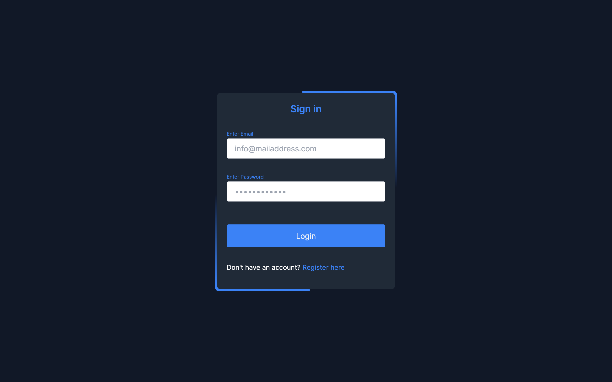</img>

### <b>Main Page:</b> 
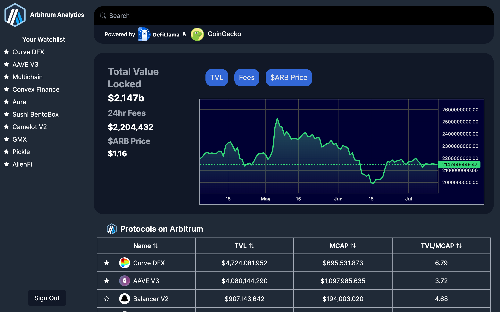</img>
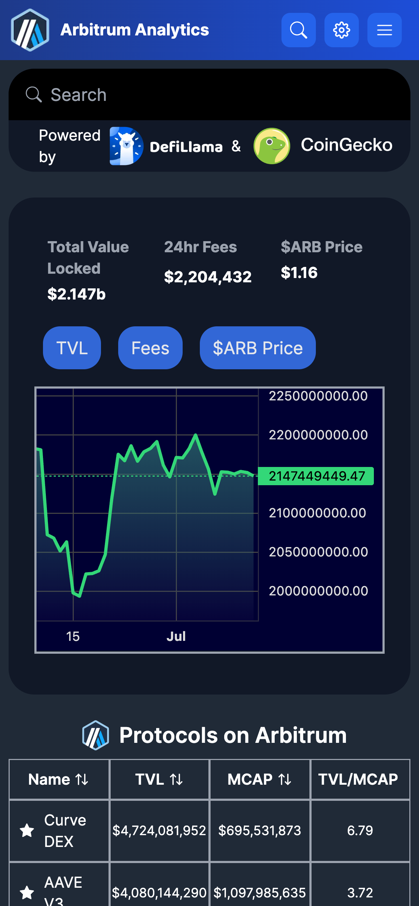</img>
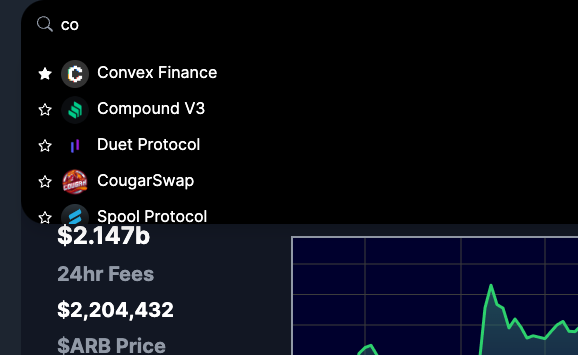</img>
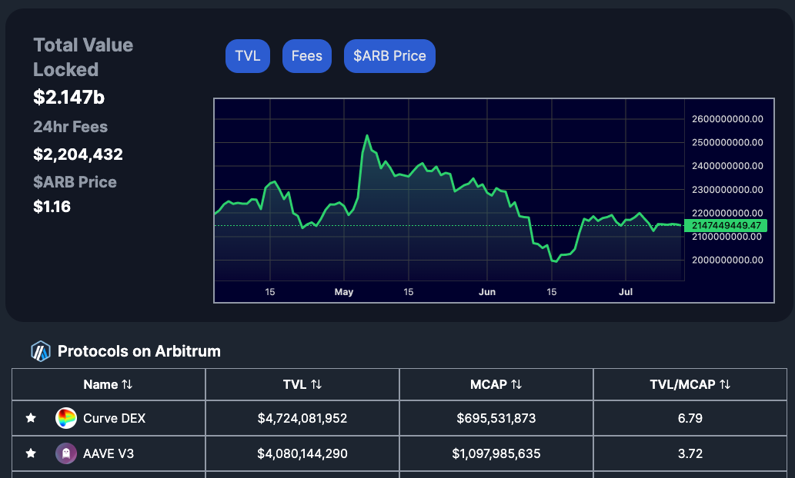</img>
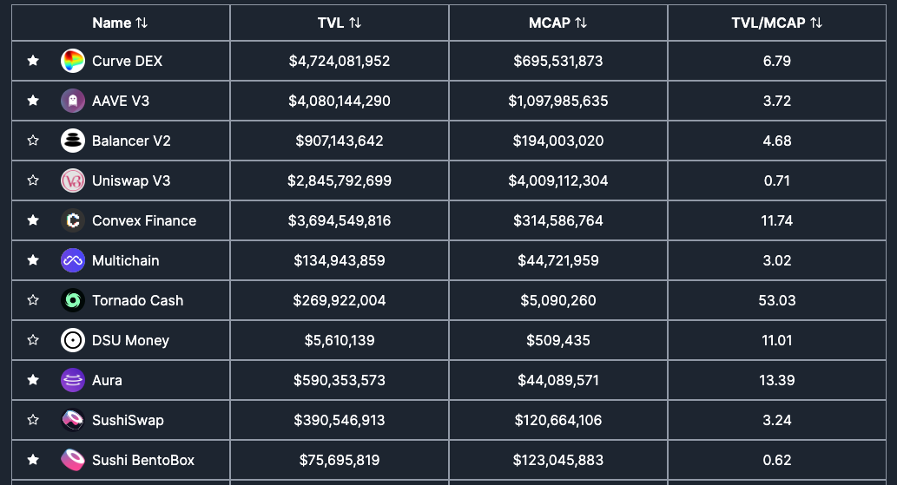</img>
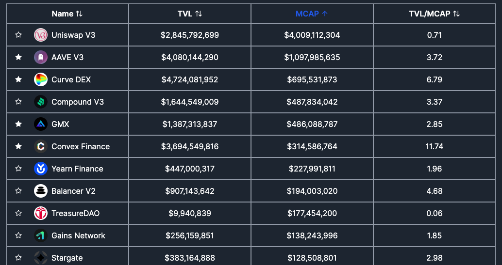</img>

### <b>Dynamic Protocols Page:</b> 
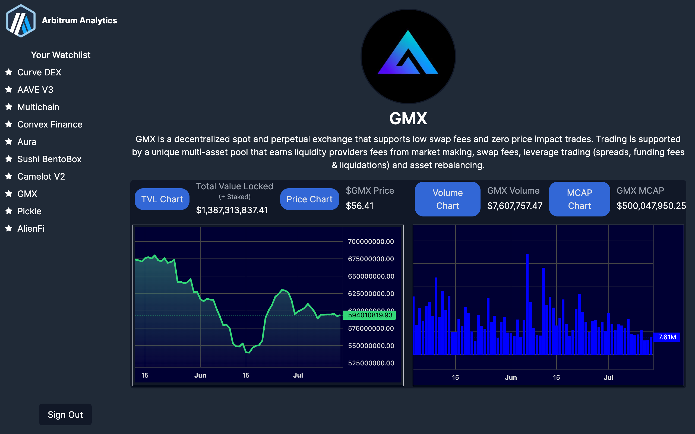</img>
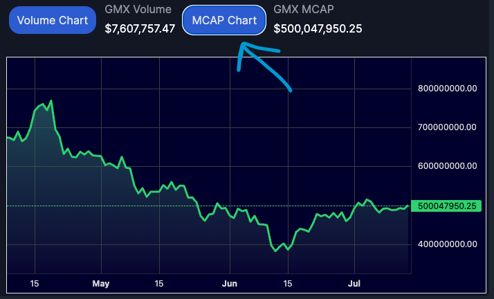</img>
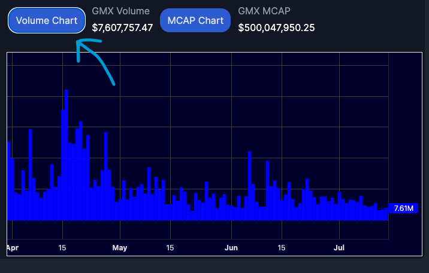</img>

### <b>PostgreSQL Database</b> 
</img>
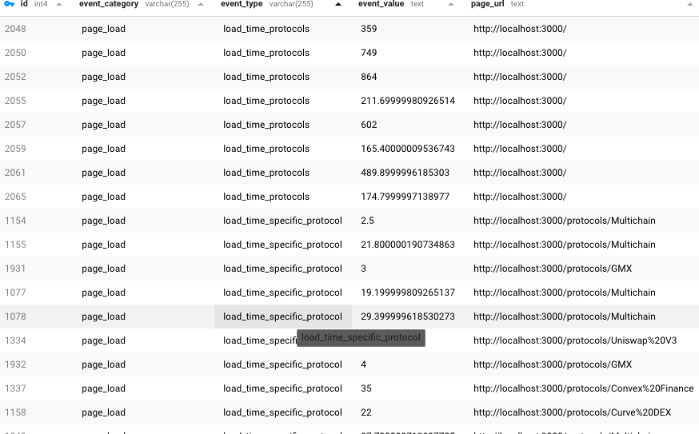</img>
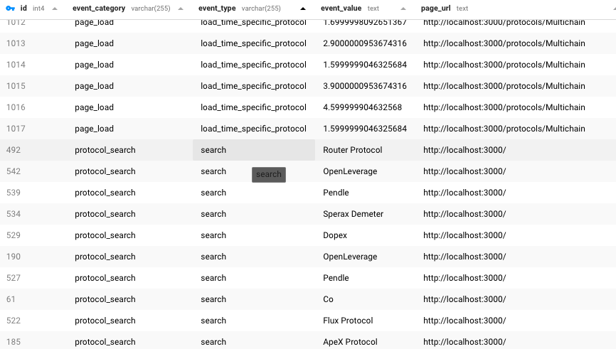</img>
 
## <a id="status">Status: 📶</a>

Arbitrum Analytics is in beta stage of development. This was a 2 week full-stack project built by Hunter and Ethan starting week 16 and ending week 17 of DigitalCrafts Bootcamp.
 

## <a id="contributions"> Contributions: 💻</a>

### <a href="www.linkedin.com/in/huntera11">Hunter Atkins (Technical Writer)</a> 
</img>
 
 

### <a href="https://www.linkedin.com/in/ethan-lehman-web3/">Ethan Lehman (Project Manager/Scrum Master)</a>
</img>
 
 

### <a href="https://www.linkedin.com/in/jordan-pufon-662769177/"> Jordan Pufon </a>
</img>
 
